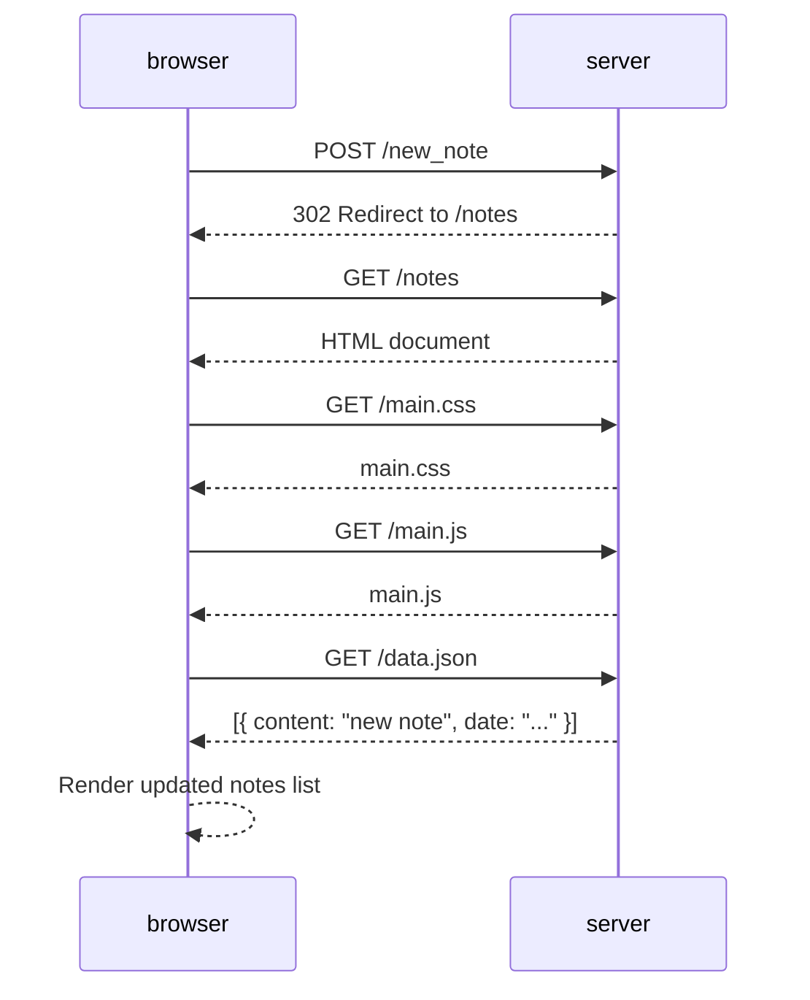

# Exercise 0.4 – New note (traditional version)

This diagram shows what happens when a user creates a new note in the classic Notes app.

```mermaid
  sequenceDiagram
      participant browser
      participant server

      browser->>server: POST /new_note
      server-->>browser: 302 Redirect to /notes
      browser->>server: GET /notes
      server-->>browser: HTML document
      browser->>server: GET /main.css
      server-->>browser: main.css
      browser->>server: GET /main.js
      server-->>browser: main.js
      browser->>server: GET /data.json
      server-->>browser: [{ content: "new note", date: "..." }]
      browser-->>browser: Render updated notes list
```
