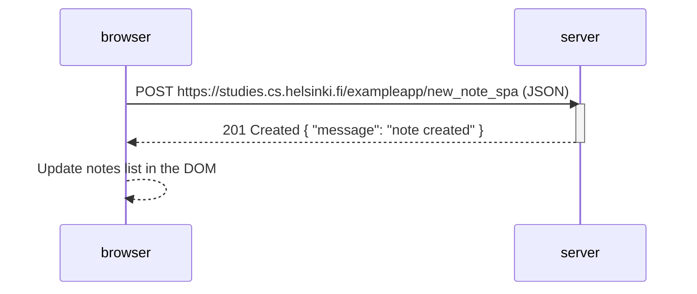

# Exercise 0.5 – New note (SPA)

This diagram shows what happens when a user creates a new note in the single page application Notes app.

```mermaid
  sequenceDiagram
      participant browser
      participant server

      browser->>server: POST https://studies.cs.helsinki.fi/exampleapp/new_note_spa (JSON)
      activate server
      server-->>browser: 201 Created { "message": "note created" }
      deactivate server

      browser-->>browser: Update notes list in the DOM
```
