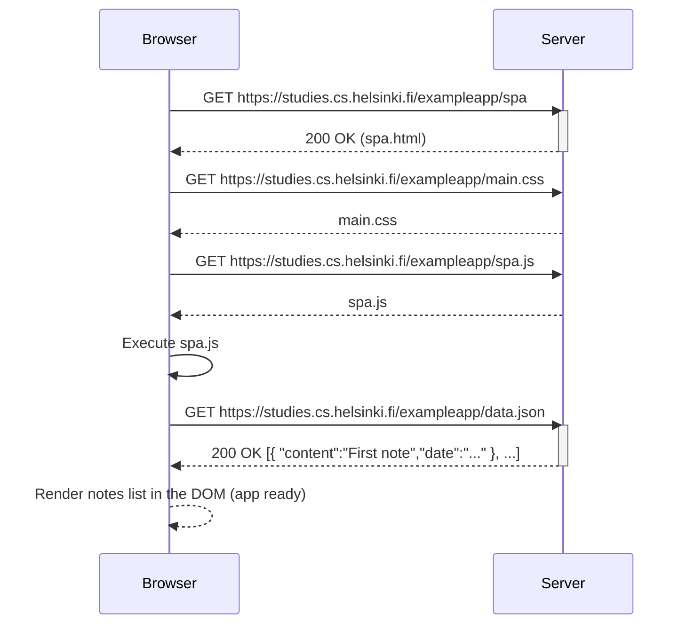

# Exercise 0.5 – Initial load (SPA version)

This diagram shows what happens when a user initially loads the single page application notes version.

```mermaid
    sequenceDiagram
        participant Browser
        participant Server

        Browser->>Server: GET https://studies.cs.helsinki.fi/exampleapp/spa
        activate Server
        Server-->>Browser: 200 OK (spa.html)
        deactivate Server

        Browser->>Server: GET https://studies.cs.helsinki.fi/exampleapp/main.css
        Server-->>Browser: main.css

        Browser->>Server: GET https://studies.cs.helsinki.fi/exampleapp/spa.js
        Server-->>Browser: spa.js

        Browser->>Browser: Execute spa.js

        Browser->>Server: GET https://studies.cs.helsinki.fi/exampleapp/data.json
        activate Server
        Server-->>Browser: 200 OK [{ "content":"First note","date":"..." }, ...]
        deactivate Server

        Browser-->>Browser: Render notes list in the DOM (app ready)
```
